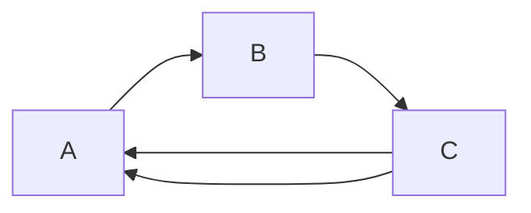
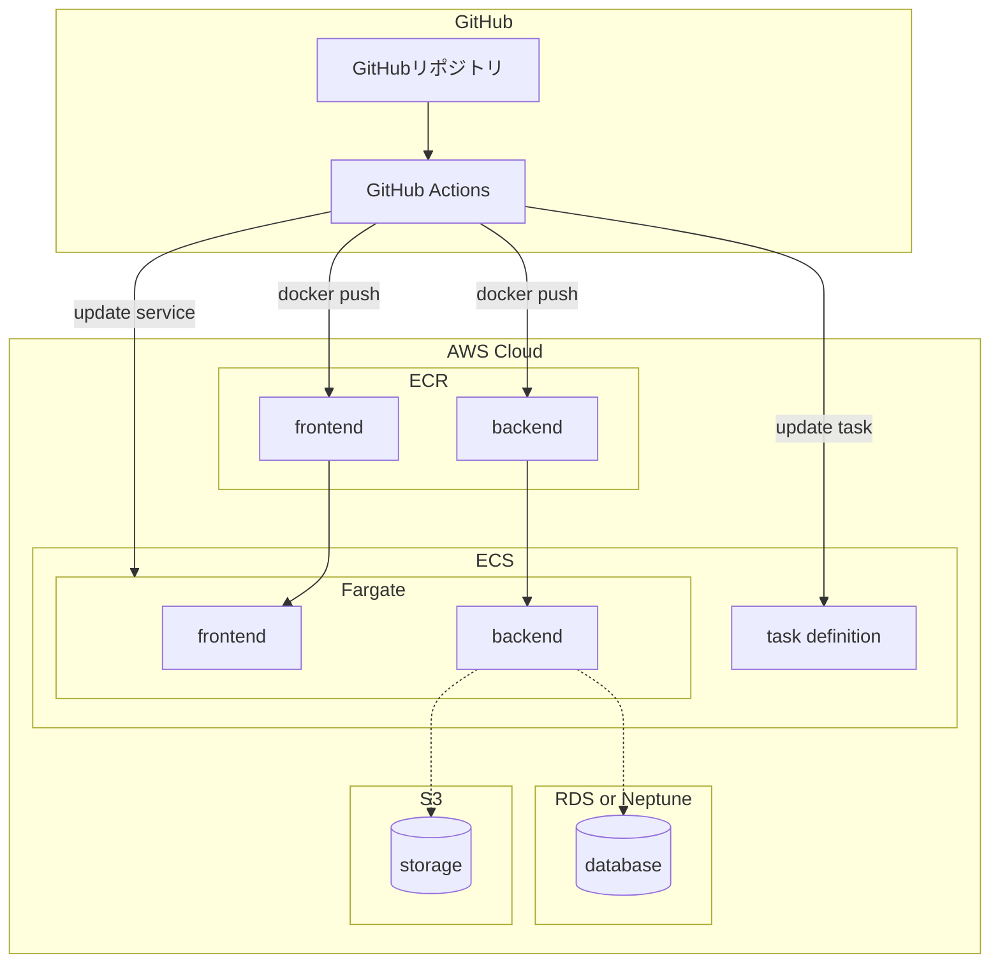

# Novel

```mermaid
flowchart LR
A --> B
B --> C
C --> A
C --> A
```

docker-compose run back python3 /back/manage.py migrate

```mermaid

flowchart

  subgraph GitHub
    GitHubリポジトリ
    GitHubActions["GitHub Actions"]

    GitHubリポジトリ --> GitHubActions
  end

  subgraph AWS Cloud

    subgraph ECR["ECR"]
      frontend_image["frontend"]
      backend_image["backend"]

      GitHubActions -- docker push --> frontend_image
      GitHubActions -- docker push --> backend_image
    end

    subgraph ECS["ECS"]
      task_definition["task definition"]

      subgraph Fargate["Fargate"]
        frontend_container["frontend"]
        backend_container["backend"]
      end

      frontend_image --> frontend_container
      backend_image --> backend_container
      GitHubActions -- update service --> Fargate
      GitHubActions -- update task --> task_definition
    end

    subgraph RDSorNeptune["RDS or Neptune"]
      DB[(database)]

      backend_container -.-> DB
    end

    subgraph S3["S3"]
      storage[(storage)]

      backend_container -.-> storage
    end
  end
```