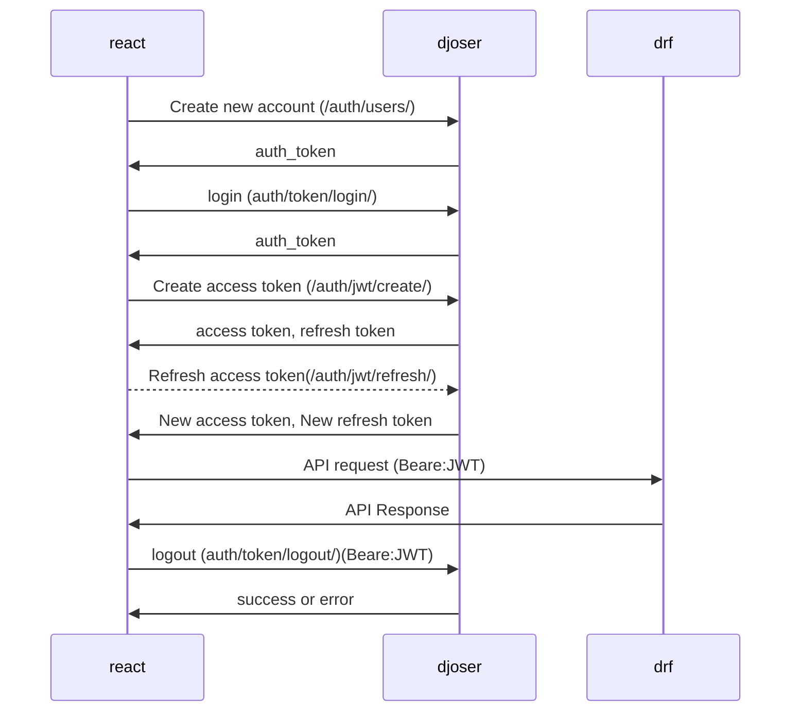

# Novel

## メモ

- ログインしているかどうかの判定をアクセストークンの所持の有無だけでいいのか
- httpOnlyのcookieにアクセストークン(jwt)を保持するのがセキ
  ュリティ的に良い?

### Built With

This section should list any major frameworks/libraries used to bootstrap your project. Leave any add-ons/plugins for the acknowledgements section. Here are a few examples.

* [![Next][Next.js]][Next-url]
* [![React][React.js]][React-url]
* [![Django][Django]][Django-url]


## Prerequirement

- yarn
- docker-compose

## Usage

### first time only

```sh
cd front

yarn
``````
### Run

```sh
docker-compose up -d

```

### Initilize databese

<!-- docker-compose exec back /bin/sh -->
```
docker-compose exec back python /back/manage.py makemigrations
docker-compose exec back python /back/manage.py migrate
docker-compose exec back python /back/manage.py createsuperuser
```
### Adopt model change

<!-- docker-compose exec back /bin/sh -->
```
docker-compose exec back python /back/manage.py makemigrations
docker-compose exec back python /back/manage.py migrate
```

if you add or remove packages from Pipfile,please run 'docker-compose build'

<!-- if you add or remove packages from packages.json or Pipfile, -->
<!-- please run 'docker-compose build' -->

### Relationship with front and back



## URL for development

- front  http://localhost:3000/
- back  http://localhost:8000/
- swagger http://localhost:8000/api/schema/swagger-ui/

## URL for storyboook

https://github.com/zutomayo147/novel-storybook

<!-- MARKDOWN LINKS & IMAGES -->
<!-- https://www.markdownguide.org/basic-syntax/#reference-style-links -->
[contributors-shield]: https://img.shields.io/github/contributors/othneildrew/Best-README-Template.svg?style=for-the-badge
[contributors-url]: https://github.com/othneildrew/Best-README-Template/graphs/contributors
[forks-shield]: https://img.shields.io/github/forks/othneildrew/Best-README-Template.svg?style=for-the-badge
[forks-url]: https://github.com/othneildrew/Best-README-Template/network/members
[stars-shield]: https://img.shields.io/github/stars/othneildrew/Best-README-Template.svg?style=for-the-badge
[stars-url]: https://github.com/othneildrew/Best-README-Template/stargazers
[issues-shield]: https://img.shields.io/github/issues/othneildrew/Best-README-Template.svg?style=for-the-badge
[issues-url]: https://github.com/othneildrew/Best-README-Template/issues
[license-shield]: https://img.shields.io/github/license/othneildrew/Best-README-Template.svg?style=for-the-badge
[license-url]: https://github.com/othneildrew/Best-README-Template/blob/master/LICENSE.txt
[product-screenshot]: images/screenshot.png
[Next.js]: https://img.shields.io/badge/next.js-000000?style=for-the-badge&logo=nextdotjs&logoColor=white
[Next-url]: https://nextjs.org/
[React.js]: https://img.shields.io/badge/React-20232A?style=for-the-badge&logo=react&logoColor=61DAFB
[React-url]: https://reactjs.org/
[Django]: https://img.shields.io/badge/-Django-092E20.svg?logo=django&style=flat-square
[Django-url]:"https://docs.djangoproject.com/en/4.1/"